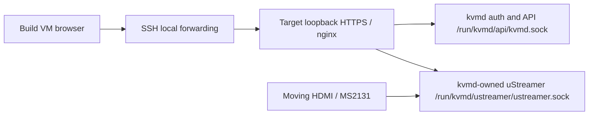

# M8-B authenticated loopback PiKVM Web UI

Status: **PASSED**, 2026-09-06. M8-A remains frozen at
`ubuntu-26.04.1-kvmd-video-baseline` (`56ee77c`). M6 GPIO/ATX remains **DEFERRED**.

## Topology and scope

The qualified access path is the Build VM's real Chromium browser, an SSH
local forward bound to `127.0.0.1:8443`, a verified SSH jump through the
LattePanda, target `127.0.0.1:443`, nginx, and the existing Unix services:

nginx has one explicit listener: `127.0.0.1:443 ssl`. No Ubuntu default site,
external configuration wildcard, plaintext HTTP listener, lab-IP HTTPS
listener or IPv6 listener is loaded. Independent `ss` and `/proc/net/tcp*`
inventories find only loopback HTTPS and the inherited `192.168.88.2:22` SSH
listener. Bridge-side connections to target ports 80, 443, 8000 and 8080 fail;
the SSH control probe succeeds. No normal-LAN web exposure is authorized.

## Pinned source, packages and reproducibility

The pinned upstream tree remains kvmd 4.213, commit
`387846d22fa807f97de09750c32c1c9b26d36c1c`, archive SHA-256
`669a21aafd7e08ca85d02a965a8f3f76b3ba63ac8539ece385b1f676bdf7fdf7`.
The source was rechecked directly from that verified archive, including
`configs/nginx`, prebuilt `web` assets, AuthManager/AuthApi, htpasswd plugin,
crypto context, cookie handling and Unix-peer authentication.

`build/kvmd-web/` builds `kvmd-web_4.213-1blikvm2_arm64.deb` and an explicit
M8-A-derived Ubuntu rootfs layer. It retains the frozen M8-A downstream video
patch and adds a separately hashed web/auth patch. It restores upstream auth
initialization, checks, routes and WebSocket session bookkeeping without
constructing hardware-control subsystems. The small UI patch removes optional
app discovery and Janus loading and keeps HID/macro transports disconnected.
The unused VNC/IPMI application pages are omitted. No new reverse-proxy API,
custom authentication service or alternate video owner is introduced.

New Ubuntu inputs are nginx/nginx-common `1.28.3-2ubuntu1.10`, acl `2.3.2-2`,
python3-passlib `1.9.3-1ubuntu1`, python3-pyotp `2.9.0-2build1`, and passlib's
required libjs-sphinxdoc dependency `8.2.3-12`. OpenSSL is inherited. The full
inventory is locked against snapshot `20260906T000000Z`; no pip resolution,
PAM backend, apache2-utils, Mako runtime, optional PiKVM services or target
browser toolchain is installed. The removed kvmd-video package retains a dpkg
metadata entry; kvmd-web is the installed daemon variant.

Two fresh package builds and two fresh public rootfs builds reproduce identical
bytes with the pinned VM builder. Frozen kernel/DTB and M8-A artifacts remain
untouched. The public artifacts are:

| Artifact | SHA-256 |
| --- | --- |
| Debian package | `8bb2beb74e51cf8fbdd1e4f125ec2b7a4cd69a47620c2d63952e2281cf10f62d` |
| Public rootfs tar/gzip | `3a40cafa3e690a0317a176d6bd9e5f2f2b96ce771514518d2cde69cdd2836347` |
| Public RAM cpio/gzip | `681c4cbe6b20ee62aac67dbfff01f3630f6fd044391f7681df06d483ac925731` |

## TLS, credentials and socket permissions

The public package/rootfs contains no htpasswd database or TLS private key.
`provision.py` generates private lab enrollment outside Git: a random test
credential, the pinned backend's SSHA512 encoding, a self-signed RSA-3072/SHA-256
certificate with localhost/loopback SANs, and a Build VM SSH authorization.
A separate cpio enrollment layer is appended to the public image. The same
private layer and complete enrolled RAM image are reused across all accepted
boots; credentials are not manually injected after boot.

The enrolled image is 88,488,270 bytes, SHA-256
`2ca086bbde9a4d5051cdc601a68f988c55371552abce35a425a31b1d1e1daa18`, within
the unchanged M8-A 96 MiB RAM window. It stays outside Git and public evidence.
Only the public certificate/fingerprint and generation procedure are archived:
`BF:BD:75:74:24:95:14:13:48:72:D3:F3:D2:81:F4:7D:71:CC:48:CB:99:0D:71:50:C7:5D:B0:8D:98:CF:32:26`.
TLS permits 1.2/1.3; the VM independently verifies certificate trust, identity
and fingerprint during each TLS 1.3 handshake. Chromium uses an isolated
profile with the development self-signed certificate allowed. This is not a
production certificate deployment.

The nginx worker is `www-data`. Named ACLs on only the two runtime socket
directories grant traversal and socket access without adding it to the video
device group. The worker cannot read/write video or HID device nodes. kvmd and
uStreamer retain their exact UID, primary GID, socket paths and modes. Trusted
root Unix-peer access remains available to inherited SSH qualification clients;
nginx is not a trusted Unix-peer account. No auth sudo helper or PAM policy is
added. nginx adds Secure to upstream HttpOnly/SameSite=Strict session cookies.

## Authenticated browser and video evidence

The automated HTTP tests require 401 for unauthenticated protected APIs/video,
a login redirect for protected application pages, 403 for invalid credentials,
200 for valid authentication, and 401/403 when replaying logged-out session
state. Authenticated WebSockets exchange real streamer events and ping/pong;
unauthenticated and logged-out handshakes fail. All excluded hardware API routes
return 404. The actual upstream login form, index logout action and browser
session transitions are exercised, not just an index-page fetch.

Chromium 145.0.7632.6 / Playwright 1.58.2 loads the real pinned HTML/CSS/JS and
renders moving 1920x1080 video. Required assets have no 404/5xx responses and
there are no JavaScript page errors. Six independently hashed canvas samples
prove motion before/after reload and after the rate measurement. Browser source,
asset/status records, WebSocket events, cookie flags and screenshots are saved.
The harness has a checked-in dependency lock; its runtime stays on the VM.

The unchanged uStreamer contract is `6.65-1blikvm2`, one kvmd-owned child,
`/dev/kvmd-video`, MJPEG 1920x1080, exact device interval 30/1 fps, desired 30 fps,
HW/pass-through encoding and native JPEG quality 0. Independent V4L2 readback,
process arguments, binary hash and live encoder state are checked. The 120-second
multipart measurement traverses nginx HTTPS and SSH at the frozen single-video-
client load. Chromium remains on the authenticated index during that measurement
and verifies moving video again afterward. This slice does not qualify multiple
simultaneous video clients.

The final preflight HTTPS run delivered 3,569 changing frames at 29.73 fps.
The final native HIL run also passed its 120-second >=27-fps gate, three HDMI
loss/restoration cycles, repeated stop/start/restart cleanup, and concurrent
host-verified keyboard, absolute mouse, relative mouse and read-only MSD tests.

## Lifecycle and HDMI recovery

`worker_shutdown_timeout 2s` permits nginx to close long-lived streams cleanly
before systemd's ten-second stop deadline. Independent nginx restart preserves
the streamer PID and browser authentication; moving video reconnects.
Independent kvmd restart removes its sockets and old child, starts exactly one
new child, and discards upstream in-memory auth sessions. The browser observes
a bounded missing-socket/502 interval, then rejects the old token and completes
normal reauthentication and moving-video recovery. No manual service repair is
used. This transient restart interval is distinguished from persistent errors.

The browser-facing HDMI test holds the actual bridge output at DPMS Off. The
MS2131 remains capture-online but supplies static no-signal JPEGs; four equal
API snapshot hashes record that condition. After restoration, Chromium again
renders changing frames with the same uStreamer PID, 4773, and a healthy kvmd.
The native HIL additionally repeats loss/restoration three times and checks
both sides of the retained USB gadget paths. Capture-online is not treated as
proof of a connected HDMI signal.

## Five clean boots

| Boot | Boot ID | HTTPS frames / unique hashes | Delivered fps |
| --- | --- | --- | --- |
| 1 | `3f3fc5a2-3c92-4f46-940a-62f7138d8d69` | 3557 / 3557 | 29.64 |
| 2 | `224f2109-2a38-431f-8a28-a69d60fc88e7` | 3573 / 3572 | 29.77 |
| 3 | `f96a00a7-f967-4868-8638-ffb3030723df` | 3577 / 3576 | 29.80 |
| 4 | `610dc12f-4ab1-4c4d-815c-da80a4d4d8b4` | 3576 / 3576 | 29.79 |
| 5 | `112ff2f6-3c6c-437d-9257-364708cd7688` | 3590 / 3590 | 29.91 |

All five consecutive clean boots pass. Each accepted boot restored services
before any HIL action, passed independent listener/reachability inventories,
retained M5/M7 regression checks, completed fresh browser authentication/WebSocket
and 120-second HTTPS video qualification, and retained one unchanged streamer
PID through that boot's smoke tests. The independent reboot audit verifies
unique boot IDs, clean systemd shutdown/U-Boot chains, one unchanged enrolled
image hash, and absence of omitted intervening attempts.

## Negative and provisional results

Failed attempts remain archived: initial sandbox/network and executable-bit
issues; a Debian conffile path error; missing VM fontconfig data that crashed
Chromium; a test-only `/dev/kvmd-web` typo; and the original nginx shutdown that
hit systemd's timeout with open streams. These are corrected in the final
candidate or harness and are not accepted runs.

An initial 5-second two-client diagnostic delivered 92 frames. A complete
120-second two-client test delivered 3,237 frames (26.97 fps), below the unchanged
3,240-frame gate. The documented qualification uses M8-A's one-video-client
load, not a lowered threshold. Two-client capacity remains unqualified.
Expected invalid-auth failures, deliberate missing optional-page probes and
the bounded kvmd-restart socket gap remain visible in logs; persistent daemon,
USB/UVC or required-asset errors are not accepted.

## Evidence and next slice

The [machine-readable acceptance record](evidence/m8b-web.json) combines successful
reproducibility, full preflight hardware/browser lifecycle checks, raw-frame
replay, independent listener/process inventories and the five-boot audit.
All 75 local tests pass. Selected reviewable evidence is in
[evidence/m8b-web](evidence/m8b-web/); the complete public archive is
`out/kvmd-web/m8b-evidence.tar.gz` (4,548,103 bytes), SHA-256
`1dcfe3c70219c259a0f43d40183e4563bd55142cae16aeaa59e90b6d814484cd`. Authenticated SFTP transferred the bridge evidence;
the VM verified its hash before replaying the acceptance gates. Private keys,
credentials, enrolled RAM images and browser cookie state are excluded.

Build manifests record M8-A parent `56ee77c` plus dirty source hashes; hardware
runs and browser records retain the actual automation snapshots/hashes. Later
validation/documentation additions do not change the tested runtime bytes.
The annotated baseline tag is `ubuntu-26.04.1-kvmd-web-baseline`.

M8-B stops before normal-LAN/wildcard HTTPS, kvmd HID/MSD/ATX integration,
GPIO/ATX, Janus/H.264/VNC/IPMI and final read-only-root work. M6 remains deferred.
Proposed M8-C: separately authorize controlled LAN HTTPS on an explicit approved
interface, define certificate trust/access policy and client-capacity gates,
then repeat authenticated browser/video, recovery and reboot qualification.
Keep hardware-control APIs disabled for that slice.
